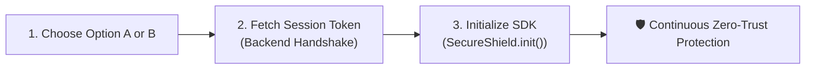

# 🛡️ SecureShield Web SDK — Integration Guide (v1.0.0)

> A fast, practical integration guide for integrating **SecureShield Web SDK** into any web application with zero friction and maximum security.

---

## ⚡ Quick Start: 3 Simple Steps



### Step 1: Choose Your Distribution Format
You have two single-file build options. Both share the **exact same JavaScript API surface**:

| Format | File | Best For | Overhead |
| :--- | :--- | :--- | :--- |
| **Option A (Standard)** | `secureshield.js` | General web apps, e-commerce, landing pages | `< 5ms` |
| **Option B (WASM-Hardened)** | `secureshield.wasm.js` | FinTech, banking, high-value checkouts | `~30ms` (WASM load) |

---

### Step 2: Fetch Ephemeral Session Token (Backend Handshake)
To prevent embedding long-lived API keys or secrets in client HTML/JS, your server generates a short-lived, signed session token (valid for 5 minutes):

```javascript
// Your backend endpoint: /api/secureshield-handshake
const response = await fetch('/api/secureshield-handshake');
const { sessionToken } = await response.json();
```

---

### Step 3: Initialize the SDK
```javascript
const shield = await SecureShield.init({
  sessionToken: sessionToken,
  serverUrl: 'https://security.yourcompany.com/api/v1/telemetry/ingest',
  enableStorageLeakScrubber: true,
  enableTabBlurShield: true
});

// Trigger initial device attestation
const verdict = await shield.ingestTelemetry();
console.log('Security Verdict:', verdict.verdict); // 'SECURE' | 'BLOCKED' | 'CHALLENGE'
```

---

## 📦 What's Inside the Release ZIP

When you download `SecureShield_Web_SDK_Release.zip`, you get a clean, single-tier folder:

```
SecureShield_Web_SDK_Release/
├── secureshield.js              <-- 📦 Option A: Single-file Hardened Obfuscated JS
├── secureshield.wasm.js         <-- ⚡ Option B: Single-file Inline WASM-Embedded JS
├── secureshield.js.sha256       <-- 🔒 Published SHA-256 Checksum (Option A)
├── secureshield.js.sri          <-- 🛡️ Subresource Integrity (SRI) Hash for <script> tag
├── secureshield.wasm.js.sha256  <-- 🔒 Published SHA-256 Checksum (Option B)
├── secureshield.wasm.js.sri     <-- 🛡️ Subresource Integrity (SRI) Hash for <script> tag
├── index.d.ts                   <-- 📘 TypeScript Definitions (for React/Next/Vue/Angular)
├── INTEGRATION_GUIDE.md         <-- 📖 This Guide
└── README.md                    <-- 📋 Quick Overview
```

---

## 🌐 1. Vanilla JavaScript / HTML Integration

### Mode A: Pinned Version with Subresource Integrity (SRI) — *Recommended for Banking & Enterprise*
Using SRI ensures that the browser blocks the script if it is ever tampered with or modified in transit:

```html
<!DOCTYPE html>
<html lang="en">
<head>
  <meta charset="UTF-8">
  <title>Enterprise Secure Portal</title>

  <!-- Option A: Standard Hardened JS Bundle -->
  <script 
    src="./secureshield.js" 
    integrity="sha384-isBs1qoZUjLT2iWWCGZa8k2I0fJBbN3uMLcUP9p/WxW8wtCcuNV7F6Ym1PBfPvpt" 
    crossorigin="anonymous" 
    async>
  </script>
</head>
<body>
  <h1>Secure Dashboard</h1>
  <p id="security-badge">Initializing security engine...</p>

  <script>
    window.addEventListener('DOMContentLoaded', async () => {
      try {
        // 1. Fetch ephemeral handshake token
        const { sessionToken } = await fetch('/api/secureshield-handshake').then(r => r.json());

        // 2. Initialize SecureShield
        const shield = await window.SecureShield.init({
          sessionToken,
          serverUrl: 'https://security.mycompany.com/api/v1/telemetry/ingest',
          enableStorageLeakScrubber: true,
          enableTabBlurShield: true,
          watermarkText: 'CONFIDENTIAL • INTERNAL WORKSPACE'
        });

        // 3. Evaluate device trust
        const verdict = await shield.ingestTelemetry();
        document.getElementById('security-badge').textContent = 
          `Status: ${verdict.verdict} (Risk Score: ${verdict.risk_score}/100)`;
      } catch (err) {
        console.error('Failed to initialize SecureShield:', err);
      }
    });
  </script>
</body>
</html>
```

### Mode B: Auto-Patching Floating Channel — *Continuous Zero-Day Protection*
If you want automatic continuous security patches without updating checksums on every release:

```html
<!-- Floating major version channel without integrity attribute -->
<script src="https://cdn.secureshield.com/sdk/v1/secureshield.js" async></script>
```

---

## ⚛️ 2. React (Vite / Next.js / CRA) Integration

### Step 1: Install Package or Place Single-File
```bash
npm install @secureshield/web
```
*(Or drop `secureshield.js` and `index.d.ts` directly into your `src/` folder)*

### Step 2: Create `SecurityProvider.tsx` (`src/providers/SecurityProvider.tsx`)
```tsx
import React, { createContext, useContext, useEffect, useState } from 'react';
import { SecureShield, ServerSecurityVerdict } from '@secureshield/web';

interface SecurityContextType {
  isSecure: boolean;
  verdict: ServerSecurityVerdict | null;
  shieldInstance: SecureShield | null;
}

const SecurityContext = createContext<SecurityContextType>({
  isSecure: false,
  verdict: null,
  shieldInstance: null
});

export function SecurityProvider({ children }: { children: React.ReactNode }) {
  const [verdict, setVerdict] = useState<ServerSecurityVerdict | null>(null);
  const [shieldInstance, setShieldInstance] = useState<SecureShield | null>(null);

  useEffect(() => {
    async function initSecurity() {
      try {
        // 1. Fetch ephemeral handshake token
        const { sessionToken } = await fetch('/api/auth/secureshield-token').then(r => r.json());

        // 2. Initialize SDK
        const sdk = await SecureShield.init({
          sessionToken,
          serverUrl: process.env.REACT_APP_SECURITY_INGEST_URL || 'https://security.mycompany.com/api/v1/telemetry/ingest',
          enableStorageLeakScrubber: true,
          enableRuntimeIntegrityWatchdog: true,
          enableTabBlurShield: true,
          watermarkText: 'PROTECTED SESSION'
        });

        setShieldInstance(sdk);

        // 3. Initial attestation scan
        const report = await sdk.ingestTelemetry();
        setVerdict(report);
      } catch (err) {
        console.error('[SecureShield] Initialization failed:', err);
      }
    }

    initSecurity();
  }, []);

  return (
    <SecurityContext.Provider value={{ isSecure: verdict?.verdict === 'SECURE', verdict, shieldInstance }}>
      {children}
    </SecurityContext.Provider>
  );
}

export const useSecurity = () => useContext(SecurityContext);
```

### Step 3: Wrap Your App (`src/App.tsx`)
```tsx
import React from 'react';
import { SecurityProvider, useSecurity } from './providers/SecurityProvider';

function Dashboard() {
  const { isSecure, verdict } = useSecurity();

  return (
    <div className="dashboard">
      <h1>My Protected App</h1>
      <div className={`badge ${isSecure ? 'badge-success' : 'badge-warning'}`}>
        Trust Status: {verdict ? verdict.verdict : 'Evaluating...'}
      </div>
    </div>
  );
}

export function App() {
  return (
    <SecurityProvider>
      <Dashboard />
    </SecurityProvider>
  );
}
```

---

## ⚡ 3. Next.js (App Router & Pages Router)

### Next.js App Router (`app/layout.tsx`)
```tsx
import { SecurityProvider } from './providers/SecurityProvider';

export default function RootLayout({ children }: { children: React.ReactNode }) {
  return (
    <html lang="en">
      <body>
        <SecurityProvider>
          {children}
        </SecurityProvider>
      </body>
    </html>
  );
}
```

### Next.js Pages Router (`pages/_app.tsx`)
```tsx
import type { AppProps } from 'next/app';
import { SecurityProvider } from '../src/providers/SecurityProvider';

export default function MyApp({ Component, pageProps }: AppProps) {
  return (
    <SecurityProvider>
      <Component {...pageProps} />
    </SecurityProvider>
  );
}
```

---

## 🟢 4. Vue 3 (Composition API & Pinia)

### `src/plugins/secureshield.ts`
```typescript
import { App, ref } from 'vue';
import { SecureShield, ServerSecurityVerdict } from '@secureshield/web';

export const securityVerdict = ref<ServerSecurityVerdict | null>(null);
export const isProtected = ref<boolean>(false);

export const SecureShieldPlugin = {
  async install(app: App) {
    try {
      const { sessionToken } = await fetch('/api/secureshield-handshake').then(r => r.json());

      const sdk = await SecureShield.init({
        sessionToken,
        serverUrl: 'https://security.mycompany.com/api/v1/telemetry/ingest',
        enableStorageLeakScrubber: true,
        enableTabBlurShield: true
      });

      const report = await sdk.ingestTelemetry();
      securityVerdict.value = report;
      isProtected.value = report.verdict === 'SECURE';
    } catch (err) {
      console.error('SecureShield Vue error:', err);
    }
  }
};
```

### Mount in `src/main.ts`
```typescript
import { createApp } from 'vue';
import App from './App.vue';
import { SecureShieldPlugin } from './plugins/secureshield';

const app = createApp(App);
app.use(SecureShieldPlugin);
app.mount('#app');
```

---

## 🅰️ 5. Angular Integration

### `src/app/services/secureshield.service.ts`
```typescript
import { Injectable } from '@angular/core';
import { SecureShield, ServerSecurityVerdict } from '@secureshield/web';

@Injectable({
  providedIn: 'root'
})
export class SecureShieldService {
  private shield: SecureShield | null = null;
  public verdict: ServerSecurityVerdict | null = null;

  async init(): Promise<void> {
    try {
      const { sessionToken } = await fetch('/api/secureshield-handshake').then(r => r.json());

      this.shield = await SecureShield.init({
        sessionToken,
        serverUrl: 'https://security.mycompany.com/api/v1/telemetry/ingest',
        enableStorageLeakScrubber: true,
        enableRuntimeIntegrityWatchdog: true,
        enableTabBlurShield: true
      });

      this.verdict = await this.shield.ingestTelemetry();
    } catch (err) {
      console.error('Angular SecureShield error:', err);
    }
  }
}
```

---

## ⚙️ Configuration Reference

| Option | Type | Default | Description |
|---|---|---|---|
| `sessionToken` | `string` | **(Required)** | Ephemeral signed handshake token generated by your backend (5-min TTL). |
| `serverUrl` | `string` | **(Required)** | Ingestion gateway URL (`https://.../api/v1/telemetry/ingest`). |
| `enableStorageLeakScrubber` | `boolean` | `true` | Scans and purges unencrypted tokens/credentials from `localStorage`/`sessionStorage`. |
| `enableRuntimeIntegrityWatchdog`| `boolean`| `true` | Audits native browser APIs and global prototype hooks. |
| `enableTabBlurShield` | `boolean` | `false` | Automatically blurs sensitive window contents when the tab is defocused or blurred. |
| `watermarkText` | `string` | `undefined` | Dynamic security overlay watermark string. |
| `enablePrototypeFreezing` | `boolean` | `false` | Deep-freezes global prototype chains to block malicious script overrides. |
| `onTamperDetected` | `Function` | `undefined` | Callback invoked when prototype tampering or hook attempts are intercepted. |
| `onRemediationTriggered` | `Function` | `undefined` | Callback invoked when a server security action (`BLOCK`, `PAUSED`) is dispatched. |

---

## ❓ Frequently Asked Questions & Troubleshooting

### Q1: What happens if WebAssembly (WASM) is disabled on a client device?
**Answer**: Option B (`secureshield.wasm.js`) automatically detects WASM availability upon initialization. If WebAssembly is unsupported or blocked by a browser policy, it seamlessly degrades to JavaScript-based signal collection without crashing your app.

### Q2: Why shouldn't I hardcode my Tenant ID or API Keys in the frontend?
**Answer**: Client-side code runs in the user's browser where all variables are visible. By using the 5-minute ephemeral `sessionToken` pattern, your backend securely authenticates the session, preventing unauthorized token theft.

### Q3: Why is my SRI hash failing on CDN updates?
**Answer**: If you are using `integrity="sha384-..."`, you **must pin a specific version** (`/sdk/v1.0.0/secureshield.js`). If you want continuous automatic security updates, link to the major version floating alias (`/sdk/v1/secureshield.js`) without the `integrity` attribute.
